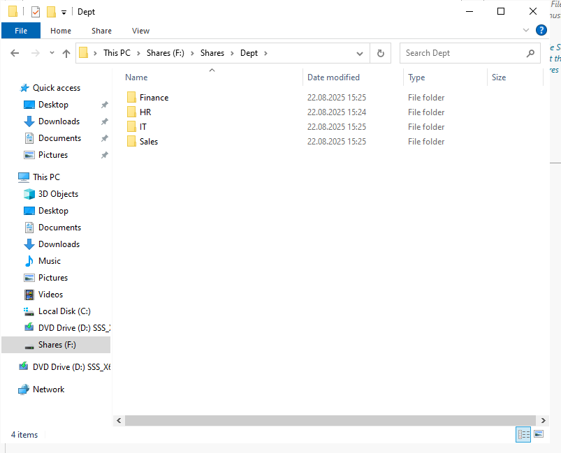

# Windows Server 2022 File Server Deployment (FS01)

This repository documents the deployment and configuration of a **Windows Server 2022 File Server** (FS01) within the `tayo.com` domain. The server provides shared storage for departments, with security group–based access, Group Policy drive mapping, and Access-Based Enumeration (ABE).

---

## 🧱 Topology & Hostnames
- **Domain Controller (DC):** `DC01-MainServer` (`10.10.10.3`)
- **File Server (FS):** `FS01` (joined to `tayo.com`)
- **Clients:** Windows 10/11 machines joined to the domain
- **Purpose:** Centralized file sharing with security-group–based folder access

---

## 📦 Repository Structure
```
.
├─ docs/            # Additional notes & exports
├─ screenshots/     # Step-by-step visuals
└─ README.md
```

---

## 1) Join Server to Domain


---

## 2) Disk Partitioning for File Share


---

## 3) Department Folder Creation



---

## 4) Group Policy Drive Mapping


---

## 5) GPO Enforcement & Testing


---

## 6) Access-Based Enumeration (ABE)


---

## 7) Verification


---

## 🔍 Notes & Best Practices
- Use **security groups** (not individual users) for share permissions.
- Combine **NTFS permissions** with **share permissions** for layered security.
- Enable **Access-Based Enumeration (ABE)** to improve user experience and security.
- Back up FS01 regularly to protect department data.
- Consider DFS Namespaces & DFS Replication for future scalability and high availability.

---

## 📜 License
This project is provided as-is for educational and lab purposes.
