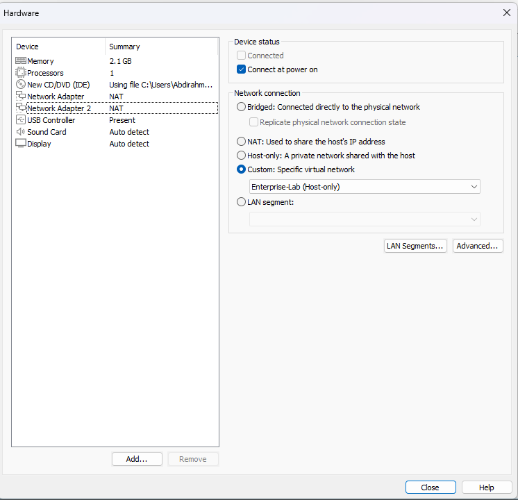

# pfSense Router & Firewall Deployment

This repository documents the deployment and configuration of **pfSense** as the primary router/firewall in the `tayo.com` lab environment. pfSense provides secure routing, DHCP services, and web-based management for the virtual network.

---

## 🧱 Topology
- **Firewall/Router:** pfSense VM (WAN ↔ LAN bridge between host and lab network)
- **Domain Controller (DC01):** `10.10.10.3`
- **File Server (FS01):** `10.10.10.5`
- **Clients:** Windows 10/11 joined to the `tayo.com` domain
- **Purpose:** Act as a firewall, DHCP/DNS forwarder, and gateway for lab services

---

## 📦 Repository Structure
```
.
├─ docs/            # Additional notes
├─ screenshots/     # Step-by-step pfSense setup visuals
└─ README.md
```

---

## 1) Virtual Machine Setup
- **Step 01:** Select pfSense ISO in VMware VM wizard  
- **Step 02:** Configure VM hardware, especially network adapters (WAN + LAN)



---

## 2) pfSense Installation
- **Step 03–04:** Start installer and proceed through copyright & welcome screens  
- **Step 05:** Configure LAN IP (e.g., `10.10.10.1/24`)  
- **Step 06–07:** Configure DHCP start and end range  


---

## 3) Post-Install Configuration
- **Step 08:** Complete setup and validate subscription check  
- **Step 09:** Review post-install details  
- **Step 10:** Access pfSense console main menu  


---

## 4) Networking Verification
- **Step 11:** Verify VMware Virtual Network Editor for NIC assignments  


---

## 5) Web Interface
- **Step 12:** Access pfSense Web UI (`https://10.10.10.1`)  
- **Step 13:** Confirm dashboard overview and firewall status  


---

## 🔍 Notes & Best Practices
- Assign **WAN** to bridged adapter (host’s internet) and **LAN** to host-only adapter (lab network).
- Change default **admin** credentials immediately after setup.
- Use **DNS Forwarder/Resolver** to integrate with DC01’s DNS.
- Always back up pfSense configuration (`Diagnostics → Backup & Restore`).
- Consider enabling **pfBlockerNG** for ad/malware blocking in the lab.

---

## 📜 License
This project is provided as-is for educational and lab purposes.
